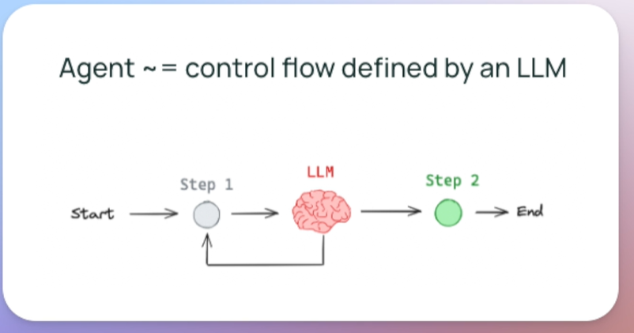
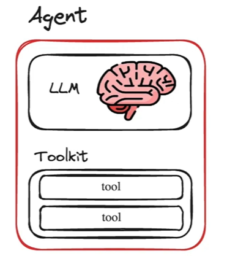
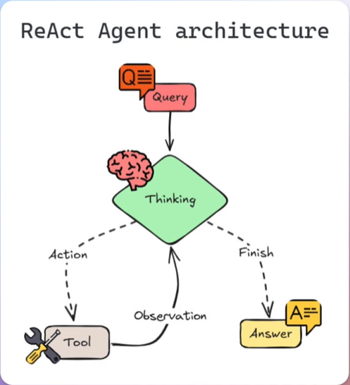
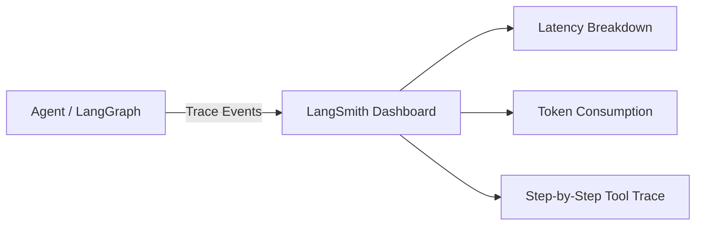

# 🤖 Agentic AI Projects & Architectures

A modern, scalable monorepo of **Agentic AI systems, autonomous workflows, and intelligent agent architectures** built with **LangChain**, **LangGraph**, **Python**, and modern frontend integration patterns.

---

## 📖 Table of Contents

01. [What is Agentic AI?](#01-what-is-agentic-ai)
02. [Core Agentic AI Architecture](#02-core-agentic-ai-architecture)
03. [Agent Paradigms & The ReAct Pattern](#03-agent-paradigms--the-react-pattern)
04. [LangChain Concepts & LCEL](#04-langchain-concepts--lcel)
05. [LangGraph Concepts](#05-langgraph-concepts)
06. [Local LLMs Setup (Ollama)](#06-local-llms-setup-ollama)
07. [Observability & Tracing (LangSmith)](#07-observability--tracing-langsmith)
08. [React & Frontend Integration](#08-react--frontend-integration)
09. [Repository Architecture](#09-repository-architecture)
10. [Projects Catalog](#10-projects-catalog)
11. [Structured Learning Path](#11-structured-learning-path)
12. [Getting Started & Setup](#12-getting-started--setup)
13. [Technology Stack](#13-technology-stack)
14. [Contributing](#14-contributing)
15. [License](#15-license)

---

## 01. What is Agentic AI?

Traditional Large Language Model (LLM) applications operate primarily in a single-turn, stateless request-response paradigm: **Prompt in, text out**. While useful for text drafting and translation, traditional LLMs lack the ability to independently pursue complex multi-step objectives, verify factual accuracy via external data sources, or self-correct upon encounter of errors.

**Agentic AI** represents the evolutionary leap from passive text generators to **active, autonomous decision-makers**. An Agentic AI system uses an LLM as its central **reasoning engine** to orchestrate dynamic workflows.



### Key Characteristics:
* **LLM as Reasoning Engine**: An agent uses an LLM to decide what actions to take, and then executes those actions.
* **Dynamic Flow vs. Hardcoded Chains**: Unlike chains where the sequence of actions is predetermined by developer code, the agent dynamically determines which tools or steps to use to solve the task.
* **Autonomous Decision Making**: Formulates plans and chooses actions at runtime.
* **Tool Usage**: Leverages external APIs, web search engines, calculators, and databases to perform actions and retrieve real-time facts.
* **State & Memory**: Maintains working memory, conversation context, and accumulated findings across multi-turn iterations.
* **Feedback & Self-Reflection**: Analyzes intermediate observations, assesses errors, and adjusts future steps accordingly.

---

## 02. Core Agentic AI Architecture

In an Agentic system, the model functions as the central "brain" orchestrating reasoning, planning, tool selection, observation capture, and state updates:



```text
               ┌───────────────────────────┐
               │        User Goal          │
               └─────────────┬─────────────┘
                             │
                             ▼
               ┌───────────────────────────┐
               │    LLM Reasoning Engine   │◄──────────────┐
               │   (Agent / Orchestrator)  │               │
               └─────────────┬─────────────┘               │
                             │                             │
                             ▼                             │
               ┌───────────────────────────┐               │
               │   Planning & Reasoning    │               │
               │   (ReAct / Decomposition) │               │
               └─────────────┬─────────────┘               │
                             │                             │
                             ▼                             │
               ┌───────────────────────────┐               │
               │      Tool Selection       │               │
               │  (Schema Function Calling)│               │
               └─────────────┬─────────────┘               │
                             │                             │
                             ▼                             │
               ┌───────────────────────────┐               │ Observation &
               │  External Tools & APIs    │               │ State Update
               │ (Search, DB, Calculation) │               │
               └─────────────┬─────────────┘               │
                             │                             │
                             ▼                             │
               ┌───────────────────────────┐               │
               │     Observation Capture   │───────────────┘
               │    & State Graph Update   │
               └─────────────┬─────────────┘
                             │
                  [Objective Complete]
                             │
                             ▼
               ┌───────────────────────────┐
               │    Final Synthesized      │
               │         Response          │
               └───────────────────────────┘
```

---

## 03. Agent Paradigms & The ReAct Pattern

### The ReAct (Reasoning + Acting) Paradigm

The **ReAct** agent architecture intertwines reasoning and tool execution in a continuous feedback loop:



1. **Thought**: The LLM reasons about what it currently knows and what it needs to find out next.
2. **Action**: The agent selects a specific tool and passes structured parameters (e.g. `search(query="Bangalore AI jobs")`).
3. **Observation**: The tool executes in the external environment and returns the real-world result back to the model.
4. **Repeat / Synthesize**: The agent inspects the observation. If sufficient information exists, it formulates the final answer; otherwise, it takes another reasoning step.

---

## 04. LangChain Concepts & LCEL

LangChain provides composable abstractions for building LLM and Agentic pipelines.

### LangChain Expression Language (LCEL)
LCEL uses the pipe operator (`|`) to compose declarative, streaming-ready pipelines:

```python
from langchain_core.prompts import PromptTemplate
from langchain_ollama import ChatOllama

# Define template
prompt = PromptTemplate(input_variables=["text"], template="Summarize this text:\n{text}")

# Initialize model
llm = ChatOllama(model="gemma4:e2b", temperature=0.2)

# LCEL Pipeline: Prompt -> LLM
chain = prompt | llm
response = chain.invoke(input={"text": "Your long text goes here."})
print(response.content)
```

### Deep Dive: How LLM Chains Work
1. **Load the Language Model (LLM):** Initializes an LLM instance (e.g. Ollama `gemma4:e2b` or OpenAI `gpt-4o-mini`).
2. **Configure the Prompt:** Prepares a `PromptTemplate` with variables ensuring the model understands the task.
3. **Set the Temperature Parameter:**
   - **Low values (0.0 - 0.3):** Highly focused, deterministic, and factual outputs (ideal for extraction, agents, and summarization).
   - **High values (0.7 - 1.0):** Creative, diverse, and varied outputs (ideal for brainstorming and creative writing).
4. **Execute with LCEL:** Composes prompt formatting, model invocation, and output parsing declaratively.
5. **Extract the Result:** Retrieves the structured `AIMessage` content.

---

## 05. LangGraph Concepts

[LangGraph](docs/concepts/langgraph-state-workflows.md) extends LangChain to build stateful, multi-actor, cyclic agent architectures:

* **State Graphs (`StateGraph`)**: Define stateful computation graphs with explicit start (`START`) and finish (`END`) boundaries.
* **Nodes & Edges**: Distinct Python functions linked by deterministic and conditional routing edges.
* **State Reducers**: Accumulative state updates (`Annotated[List[str], operator.add]`) across nodes.
* **Cycles & Refinement Loops**: Enable agents to iterate, critique, and self-correct until a stop condition is met.
* **Checkpointing & Persistence**: Snapshot state to disk or database for time-travel debugging and pause/resume execution.
* **Human-in-the-Loop (HITL)**: Pause graph execution before high-stakes tool calls to require human approval.

---

## 06. Local LLMs Setup (Ollama)

Run models locally with zero API fees, low latency, and 100% data privacy.

### 1. Download & Install Ollama
Visit [Ollama's official website](https://ollama.com/) to install Ollama for Windows, macOS, or Linux.

### 2. Recommended Models
Browse available models on the [Ollama Library](https://ollama.com/search):
- `gemma4:e2b` / `gemma2:2b`: Fast and reliable for local agent routing.
- `gemma3:1b` / `gemma3:270m`: Ultra-lightweight models for quick testing.
- `llama3.2:3b`: Excellent tool-calling and reasoning performance.

### 3. Pull & Run Models
```bash
# Pull model
ollama pull gemma4:e2b

# Run model in terminal
ollama run gemma4:e2b

# List installed models
ollama list
```

### 4. Automated Model Downloader
Run the repository script to automatically pull all recommended models:
```bash
python scripts/setup/pull_ollama_models.py
```

---

## 07. Observability & Tracing (LangSmith)

[LangSmith](https://smith.langchain.com/) provides complete visibility into agent decision trees, tool call latencies, and token expenditures.



### Setup Steps:
1. **Sign Up**: Create an account at [smith.langchain.com](https://smith.langchain.com/).
2. **Create Project**: Create a new project in the LangSmith dashboard.
3. **Set Environment Variables**:
   Add to your `.env` file:
   ```env
   LANGSMITH_TRACING=true
   LANGSMITH_ENDPOINT=https://api.smith.langchain.com
   LANGSMITH_API_KEY=your_langsmith_api_key_here
   LANGSMITH_PROJECT=agentic-ai-portfolio
   ```
   *(Note: For EU accounts, use `LANGSMITH_ENDPOINT=https://eu.api.smith.langchain.com`)*
4. **Automatic Tracing**: Once configured, all LangChain chains and LangGraph workflows trace automatically without extra code changes.

---

## 08. React & Frontend Integration

For production applications, the Agentic AI backend connects seamlessly with React frontends (detailed in [docs/architecture/frontend-integration.md](docs/architecture/frontend-integration.md)):

- **Server-Sent Events (SSE) Streaming**: Streaming token chunks and intermediate tool-execution status in real time.
- **State Synchronization**: Reflecting LangGraph node transitions and action logs in client state managers.
- **Human Approval Interfaces**: Interactive modal cards enabling users to review and approve pending agent actions.

---

## 09. Repository Architecture

```text
Agentic-AI/
├── README.md                          # Master architectural & conceptual guide
├── LICENSE                            # MIT License
├── CONTRIBUTING.md                    # Contribution guidelines
├── CODE_OF_CONDUCT.md                 # Contributor Covenant
├── .gitignore                         # Comprehensive ignore rules
├── .env.example                       # Environment variables template
├── pyproject.toml                     # Root workspace configuration
│
├── docs/
│   ├── architecture/
│   │   ├── agentic-ai-patterns.md     # ReAct, Plan-and-Solve, LangGraph topologies
│   │   └── frontend-integration.md    # React & SSE streaming integration
│   ├── concepts/
│   │   ├── langchain-fundamentals.md  # LCEL, Prompts, Tools, Structured Outputs
│   │   └── langgraph-state-workflows.md# Graphs, State Reducers, Checkpoints
│   ├── guides/
│   │   ├── environment-setup.md       # Python & uv workspace setup
│   │   ├── ollama-local-llms.md       # Running Ollama models offline
│   │   └── langsmith-tracing.md       # Observability & tracing
│   ├── diagrams/                      # Preserved diagram assets (image.png, etc.)
│   └── repository-reorganization-report.md # Transformation & Gap analysis report
│
├── projects/
│   ├── 01-llm-chains-and-prompts/     # LCEL Chains, Prompt Templates & Summarization
│   │   ├── README.md, pyproject.toml, src/, tests/
│   ├── 03-ai-search-agent/            # Autonomous ReAct Search Agent with Tavily
│   │   ├── README.md, pyproject.toml, src/, tests/
│   └── 04-langgraph-state-workflows/  # Stateful Multi-Node LangGraph Orchestration
│       ├── README.md, pyproject.toml, src/, tests/
│
├── shared/
│   ├── python/utils/                  # Unified model factory, env loader, structured logger
│   ├── python/schemas/                # Standard AgentActionLog & ExecutionResult schemas
│   └── prompts/                       # Centralized system prompts
│
├── scripts/
│   ├── setup/                         # Setup verification & Ollama model downloader
│   ├── development/                   # Cross-project automated test runner
│   └── validation/                    # Repository integrity validator
│
└── config/
    └── templates/project-template/    # New project scaffold
```

---

## 10. Projects Catalog

| Project | Description | Key Concepts | Primary Technologies |
| :--- | :--- | :--- | :--- |
| [01 - LLM Chains & Prompts](projects/01-llm-chains-and-prompts/README.md) | Composable LCEL chains for document summarization with prompt templating. | LCEL, PromptTemplate, Multi-Provider | LangChain, Ollama, OpenAI, Python |
| [03 - AI Search Agent](projects/03-ai-search-agent/README.md) | Autonomous ReAct agent with real-time web search integration. | ReAct Loop, Tool Calling, Web Search Grounding | LangChain, Tavily API, Ollama, Python |
| [04 - LangGraph Workflows](projects/04-langgraph-state-workflows/README.md) | Stateful multi-node graph orchestration with conditional routing. | StateGraph, Typed State, Reducers, Conditional Edges | LangGraph, LangChain, Python |

---

## 11. Structured Learning Path

Follow this recommended learning path to master Agentic AI from first principles to advanced state graph orchestration:

```text
1. [Foundation] LCEL & Prompt Templating       --> projects/01-llm-chains-and-prompts
2. [Autonomy] ReAct Loops & Live Web Tools    --> projects/03-ai-search-agent
3. [Graphs] State Machines & Dynamic Routing  --> projects/04-langgraph-state-workflows
4. [Advanced] Checkpointing, HITL & React UI  --> docs/architecture/frontend-integration.md
```

---

## 12. Getting Started & Setup

### 1. Prerequisites
- **Python 3.11+**
- Package manager: **uv** (recommended) or **pip**
- Optional: [Ollama](https://ollama.com/) for local models

### 2. Environment Setup with `uv` (Fast)
```bash
# 1. Install uv
pip install uv

# 2. Create and activate virtual environment
uv venv
.venv\Scripts\Activate.ps1    # Windows
# source .venv/bin/activate   # macOS/Linux

# 3. Install dependencies in editable mode
uv pip install -e ".[dev]"
```

### 3. Environment Setup with `pip`
```bash
# 1. Create and activate venv
python -m venv .venv
.venv\Scripts\activate        # Windows
# source .venv/bin/activate   # macOS/Linux

# 2. Install workspace dependencies
pip install -e ".[dev]"
```

### 4. Configure Environment Variables
Copy `.env.example` to `.env` and configure your API keys:
```bash
cp .env.example .env
```

### 5. Running Projects & Examples
```bash
# Windows PowerShell
$env:PYTHONPATH = "."
uv run python .\projects\01-llm-chains-and-prompts\src\app.py

# macOS / Linux
PYTHONPATH=. uv run python projects/01-llm-chains-and-prompts/src/app.py
```

### 6. Validate Repository & Run Test Suites
```bash
# Verify integrity of all projects, docs, and python syntax
uv run python scripts/validation/validate_repo.py

# Run all test suites across projects
uv run python scripts/development/run_all_tests.py
```

---

## 13. Technology Stack

- **Core Frameworks**: LangChain 1.x, LangGraph, Pydantic
- **LLM Providers**: Ollama (Local open-weights), OpenAI, Groq
- **Tools & Retrieval**: Tavily Search API
- **Observability**: LangSmith
- **Tooling & Testing**: Pytest, Black, isort, uv

---

## 14. Contributing

We welcome contributions of new agent patterns, tools, and workflows! Please read our [CONTRIBUTING.md](CONTRIBUTING.md) and [CODE_OF_CONDUCT.md](CODE_OF_CONDUCT.md) for details on our code quality standards and new project scaffolding.

---

## 15. License

This repository is licensed under the [MIT License](LICENSE).
