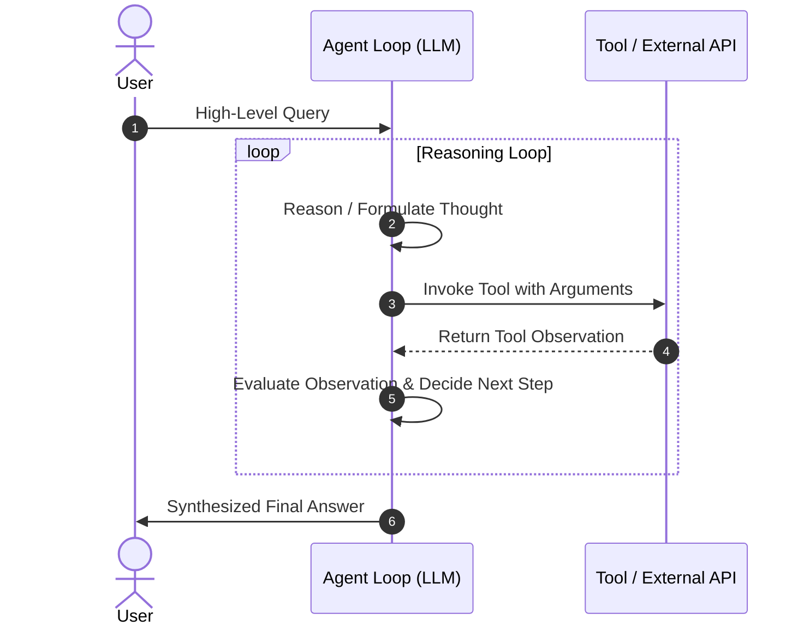

# Agentic AI Architecture & Patterns

This document provides a technical deep-dive into the architectural patterns governing autonomous and semi-autonomous Agentic AI systems.

---

## 1. Traditional LLMs vs. Agentic Systems

```text
┌────────────────────────────────────────────────────────┐
│               Traditional LLM Invocation               │
│                                                        │
│   User Prompt ───► [ LLM Parametric Memory ] ───► Response   │
└────────────────────────────────────────────────────────┘

┌────────────────────────────────────────────────────────┐
│                  Agentic AI System                     │
│                                                        │
│                       ┌─────────────┐                  │
│   User Goal ─────────►│  Reasoning  │◄──────┐          │
│                       │   Engine    │       │          │
│                       └──────┬──────┘       │ State &  │
│                              │ Action /     │ Observ-  │
│                              ▼ Tool Call    │ ation    │
│                       ┌─────────────┐       │          │
│                       │ Tools & APIs│───────┘          │
│                       └─────────────┘                  │
└────────────────────────────────────────────────────────┘
```

| Dimension | Traditional LLM Chain | Agentic AI System |
| :--- | :--- | :--- |
| **Control Flow** | Hardcoded, static, deterministic sequence | Dynamic, self-directed loop determined by LLM reasoning |
| **Tool Execution** | Fixed API calls triggered by developer code | Dynamic tool selection and parameterized invocation by the model |
| **State Management** | Ephemeral, stateless per invocation | Persistent, accumulative memory with state reducers |
| **Error Handling** | Application-level try/catch exceptions | Self-correction and reflection based on tool error feedback |
| **Autonomy** | Zero autonomy (prompt-in, text-out) | Semi-to-fully autonomous multi-step execution |

---

## 2. Core Agent Architectures

### A. ReAct (Reasoning + Acting)
The **ReAct** pattern intertwines step-by-step reasoning ("Thought") with action execution ("Action") and environment feedback ("Observation").



### B. Plan-and-Solve
1. **Planner**: Breaks a complex prompt into an ordered list of atomic sub-tasks.
2. **Executor**: Executes each step sequentially, passing intermediate artifacts.
3. **Re-planner**: Adjusts remaining steps if an intermediate task fails or yields unexpected data.

### C. State Machine & Graph Orchestration (LangGraph)
Represents agentic workflows as explicit state graphs where:
- **Nodes**: Python functions performing computation or tool calls.
- **Edges**: Deterministic transitions between nodes.
- **Conditional Edges**: Dynamic routing decisions based on runtime state values.
- **Checkpointers**: Persisted state snapshots enabling interrupts and human approval.

---

## 3. Tool Calling & Schema Contracts

Tools are bound to models using standardized JSON schema specifications. When a model determines it requires external capabilities, it outputs a structured tool invocation object:

```json
{
  "name": "search",
  "args": {
    "query": "senior mobile developer AI jobs bangalore"
  }
}
```

The orchestrator executes the tool and injects the output back as a `ToolMessage` into the conversation history.
