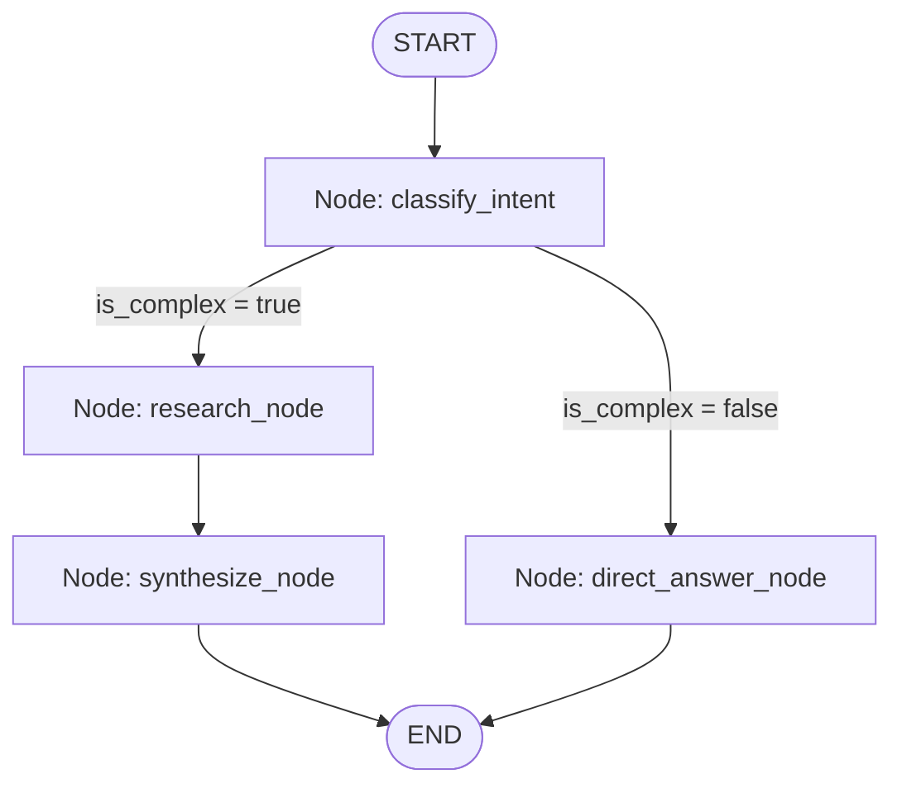

# 04 - LangGraph State Workflows & Conditional Routing

A modular implementation of a **Stateful Multi-Node Graph Workflow** using **LangGraph**, demonstrating typed state schemas, state reducers, conditional branching, and graph compilation.

---

## 📌 Project Overview

While traditional chains run in a fixed linear or DAG sequence, complex agentic systems require:
1. **Dynamic Branching**: Conditionally choosing nodes based on the evolving state.
2. **Accumulative State**: Appending notes, tool outputs, and reflection data across nodes using state reducers (e.g., `operator.add`).
3. **Loop Control & Cycles**: Enabling agent iterative refinement loops while bounding iteration depth.

This project implements a multi-node research graph that dynamically routes incoming queries through classification, deep research retrieval, or immediate answering nodes before synthesizing a final structured response.

---

## 🧠 Agentic AI Concepts Demonstrated

- **Graph Topology**: Defining states with `StateGraph`, `START`, and `END`.
- **Typed State Schemas**: Strict data contracts using Python's `TypedDict`.
- **State Reducers**: Annotated state fields (`Annotated[List[str], operator.add]`) for appending context across distributed nodes.
- **Conditional Edges**: Dynamic routing functions directing control flow based on state evaluation.
- **Durable Orchestration**: Foundation for checkpoints, human-in-the-loop approvals, and multi-agent coordination.

---

## 🏗️ StateGraph Architecture



---

## 🚀 Setup & Execution

### 1. Prerequisites
- Python 3.11+
- Dependencies: `langgraph`, `langchain-core`, `pydantic`

### 2. Install Dependencies
```bash
pip install -e .
```

### 3. Run the Graph Runner
```bash
# Complex query triggering the research & synthesis path
python -m src.app --query "Research and compare agent memory vs vector RAG architectures."

# Simple query routing to direct answer
python -m src.app --query "Hello, how are you today?"
```

### 4. Run Unit Tests
```bash
pytest tests/
```

---

## 📂 Project Structure

```text
04-langgraph-state-workflows/
├── README.md           # Project documentation
├── pyproject.toml      # Dependencies
├── src/
│   ├── __init__.py
│   ├── state.py        # TypedDict state schema & reducers
│   ├── nodes.py        # Graph node handlers
│   ├── workflow.py     # StateGraph wiring & compilation
│   └── app.py          # CLI entry point
└── tests/
    └── test_workflow.py # Unit tests
```
